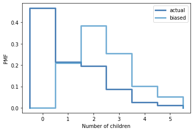

[Think Stats Chapter 3 Exercise 1](http://greenteapress.com/thinkstats2/html/thinkstats2004.html#toc31) (actual vs. biased)

The problem we're addressing in this section is the class size paradox, which is the bias found when surveying a sample about its observations about itself, for example, children being asked how many children there are in their family. The biases found in this example are that families with more children will be more likely to be surveyed, and obviously families without children will not be surveyed at all.

The goal of this assignment is to compute the baised distribution, compare it to the actual distribution and show them visually. The method we're going to use will be presented in a probability mass function and compared visually via step function.

A probability mass function is a means to represent a distribution where a frequency is expressed as a fraction of the total sample size, normalizing the data. Instead of showing the data as an integer representing the count of certain values, pmfs show us the data as a float representing the probability a certain value represents when compared to the data as a whole.

As for the bias calculation, ThinkStats has provided us with the function BiasPmf:

~~~
def BiasPmf(pmf, label):
    new_pmf = pmf.Copy(label=label)

    for x, p in pmf.Items():
        new_pmf.Mult(x, x)
        
    new_pmf.Normalize()
    return new_pmf
~~~

This function works as follows, for each actual number of children per family, we multiply the probability by the number of children able to report on that family size. You can see the result below graphed on top of the actual number:

~~~
resp = nsfg.ReadFemResp()
actual
pmf = thinkstats2.Pmf(resp.numkdhh, label='actual')
thinkplot.Pmf(pmf)
thinkplot.Config(xlabel='Number of children', ylabel='PMF')

biased = BiasPmf(pmf, label='biased')
thinkplot.PrePlot(2)
thinkplot.Pmfs([pmf, biased])
thinkplot.Config(xlabel='Number of children', ylabel='PMF')
~~~

From this points it's quite simple to calculate their means:

~~~

pmf.Mean()
biased.Mean()
~~~
The results are 1.024 for the actual mean, and 2.404 for the biased mean; quite the difference!