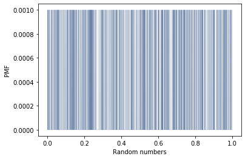
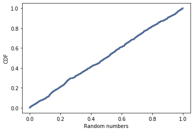

[Think Stats Chapter 4 Exercise 2](http://greenteapress.com/thinkstats2/html/thinkstats2005.html#toc41) (a random distribution)

The problem of analysing the actual randomness of a random number generator is one best tackled by cumulative distribution functions (CDFs). CDFs map values to their respective probabilities, i.e. CDF(*x*) is the fraction of sample that is less than of equal to *x*. CDFs do an excellent job of representing a sample that has too many values to be represented in a PMF. The respective visualizations of a PMF tasked to graph 1000 random variables and CDF show this discrepancy in efficacy dramatically, as shown below:

~~~
random_numbers = np.random.random(1000)

pmf = thinkstats2.Pmf(random_numbers)
thinkplot.Pmf(pmf, linewidth=0.1)
thinkplot.Config(xlabel='Random numbers', ylabel='PMF')

cdf = thinkstats2.Cdf(random_numbers)
thinkplot.Cdf(cdf)
thinkplot.Config(xlabel='random numbers', ylabel='CDF')
~~~

**PMF:**

**CDF:**

